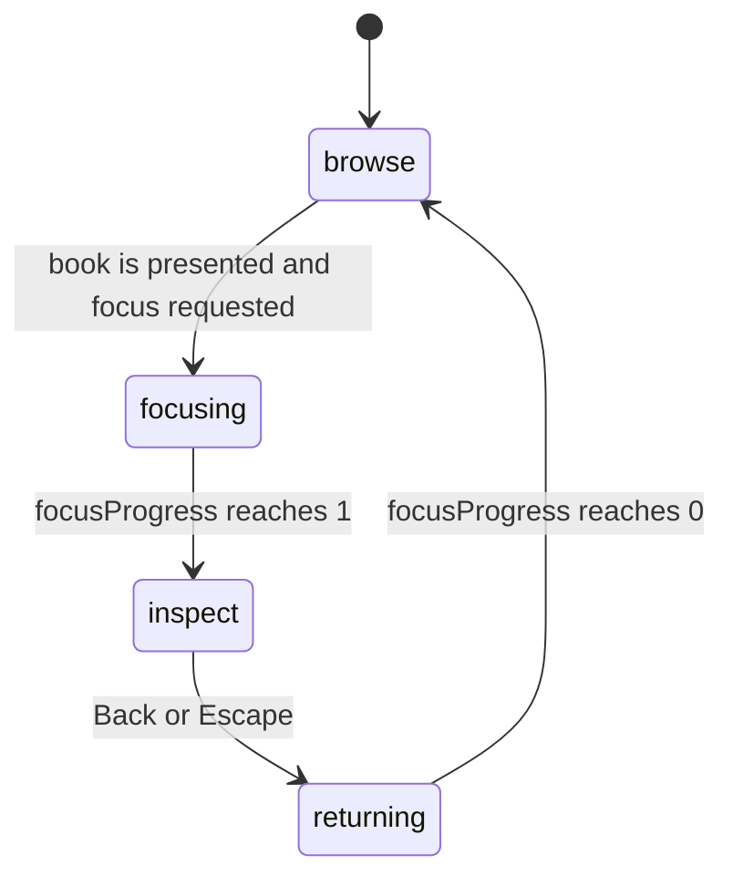
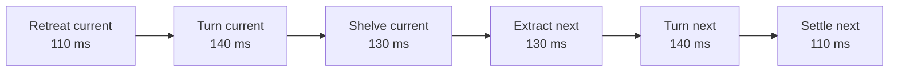

# Motion, objects, and animation feel

This document explains how the bookshelf’s Three.js objects, animation states,
camera, and HTML interface work together. It is also the tuning guide for
changing the motion without making the shelf feel slow, slippery, or physically
impossible.

The short version: React owns durable interface state, one `ShelfEngine` owns
all frame-by-frame Three.js state, and pure pose functions describe where a
book may move. There is no general-purpose tweening library.

## Source map

- `app/ShelfEngine.ts` owns the renderer, scene, camera, controls, input,
  animation frame, object lifecycle, and disposal.
- `app/book-motion.ts` contains pure browse/focus pose functions and
  collision math.
- `app/ProgressLibrary.tsx` projects engine callbacks into accessible HTML
  controls and details.
- `app/globals.css` coordinates the HTML transitions with the 3D modes.
- `app/catalog.ts` supplies each book’s height and thickness.
- `tests/rendered-html.test.mjs` samples motion paths and guards the timing
  envelope.

## Object hierarchy

Every book uses stable wrapper groups so presentation motion is independent of
the visual source:

```text
scene
└── shelfGroup                    horizontal browse translation
    ├── shelfFurniture            shelf boards; hidden in close inspection
    └── slot                      permanent catalog position and book height
        └── content               animated x, z, yaw, scale, and hover lift
            └── inspectionIdle    centered, reduced-motion-aware idle motion
                ├── physical      procedural boards, pages, spine, cover art
                ├── assetHolder   optional imported edition mesh
                ├── titleDecal    optional overlay for imported editions
                ├── living shimmer optional animated shader plane
                └── pickProxy     invisible, simple raycast geometry
```

The `slot` never participates in the book choreography. It anchors a volume to
its place on the continuous shelf. The `content` group receives every
presentation pose, so procedural geometry, custom cover images, and imported
meshes all inherit the same behavior.

An imported mesh is normalized and scaled inside `assetHolder`; it does not
change the motion coordinate system. Likewise, a custom `coverImage` replaces
only the procedural front texture. This separation is why asset swaps do not
need new animation code.

The `inspectionIdle` group has its origin at the book center. It adds only a
small, slowly varying lift and rotation after inspection becomes interactive,
so procedural and imported editions share the same centered idle motion.

## One animation owner

`ShelfEngine.animate()` is the only request-animation-frame loop. Each frame it:

1. clamps `delta` to at most 50 ms, preventing a background-tab pause from
   creating one giant motion step;
2. advances the interaction state;
3. updates selected-book and shader presentation;
4. updates OrbitControls only while inspection is active;
5. renders once;
6. refreshes lightweight diagnostics twice per second.

React does not receive per-frame positions. The engine only calls React when
the active index, interaction mode, or status actually changes. This avoids a
component render for every WebGL frame.

The high-level state machine is:



OrbitControls are disabled in `browse`, `focusing`, and `returning`. They turn
on only in `inspect`, after the engine has finished framing the selected book.
That prevents user input and scripted camera movement from fighting over the
same transform.

## Browse motion

Browsing has two related values:

- `targetScrollIndex` responds immediately to wheel, drag, arrow, Home, End,
  and shelf-tick input.
- `scrollIndex` damps toward the target and drives the horizontal position of
  `shelfGroup`.

After 150 ms without pointer input, the target itself damps toward the nearest
integer. That creates a magnetic landing on a book without making direct drag
input feel sticky.

The visible handoff between books is deliberately discrete. The current book
leaves before the next one enters:



Each phase uses smoothstep interpolation from `browseMotionPose()`. Keeping the
phase functions pure makes the route deterministic and allows the tests to
sample it without WebGL.

The temporary `rotationLaneZ` is calculated from the largest book’s rotated
radius, rather than being guessed for one catalog. A book retreats into that
clear lane before turning, then approaches the shelf after its yaw is safe.

## Focus and return

Opening a book takes 460 ms; returning takes 340 ms. Focus progress is
time-based, so the duration does not depend on frame rate.

`focusedBookPose()` divides the opening into two overlapping intentions:

1. During the first 55%, the book moves forward to clear its neighbors.
2. During the final 45%, it shifts into the inspection composition and scales.

The visual focus value uses an ease-out cubic curve, making the action feel
decisive at the start and controlled near the endpoint. Return uses the same
route in reverse from the live focus progress, so an interrupted state does not
teleport.

The camera and OrbitControls both target the selected book’s exact world
center. An asymmetric camera view offset accounts for the HTML details panel,
placing the book in the center of the unobscured canvas without moving the
orbit pivot away from the book. Mobile uses a centered, smaller pose and a
slightly wider camera.

Camera interpolation uses:

```ts
1 - Math.exp(-lambda * delta)
```

This is frame-rate-independent exponential smoothing. Unlike a fixed
per-frame lerp amount, it has approximately the same feel at different refresh
rates.

## What creates the snappy feel

Snappiness here does not mean making every duration zero. It comes from quick
acknowledgement followed by controlled settling:

| Control | Current value | Effect |
| --- | ---: | --- |
| Wheel sensitivity | `0.0024` index units per delta unit | Moves the target promptly without skipping the shelf too easily |
| Drag scale | canvas width × `0.11`, minimum `105px` | Keeps touch and mouse travel proportional to the viewport |
| Idle snap delay | `150ms` | Lets deliberate input finish before snapping |
| Shelf damping | `lambda 10` | Makes the shelf follow input closely |
| Target snap damping | `lambda 8.5` | Gives the final index a softer magnetic landing |
| Book hover damping | `lambda 12` | Makes hover feedback arrive faster than shelf movement |
| Focus duration | `460ms` | Reads as a deliberate open action without lingering |
| Return duration | `340ms` | Makes dismissal faster than entry |
| Focus camera damping | `lambda 13` | Keeps camera framing close behind the book |
| Browse camera damping | `lambda 7` | Softly restores the canonical camera |
| Orbit damping factor | `0.075` | Removes raw pointer jitter during inspection |

When tuning, change one layer at a time:

- Input constants change how quickly intent is collected.
- Damping lambdas change how tightly displayed state follows intent. A larger
  lambda is faster.
- Phase durations change the physical choreography.
- Easing changes acceleration and landing character.
- Focus position and scale change composition, not timing.

Avoid replacing time-based damping with a fixed amount per frame. Avoid
shortening the rotation phases until the cover can visibly pass through the
next book.

## Collision safety

Every proposed content pose passes through `commitBookPose()`. Before applying
it, the engine constructs a top-down oriented rectangle for the moving book and
tests it against every other book with the separating axis theorem.

The footprint includes:

- the catalog slot plus the proposed local offset;
- current yaw;
- current presentation scale;
- book width and thickness;
- a small collision margin.

If a pose would overlap another footprint, it is rejected and counted in the
diagnostics. The tests sample all six browse phases and the focus route for
every volume, including the largest dimensions in the catalog.

If book dimensions move outside the ranges recommended in
`docs/adding-books.md`, rerun the tests before changing any motion constants.
The computed rotation lane should normally adapt without manual adjustment.

## 3D and HTML coordination

The engine reports `browse`, `focusing`, `inspect`, or `returning` through
`onMode`. `ProgressLibrary` turns those into `is-browsing` and `is-focused`
classes.

CSS then handles interface-only motion:

- browse caption exits left;
- navigation arrows and shelf ticks fade away;
- the details panel enters from the right;
- status and independence copy fade;
- loading and optional asset panels use their own transitions.

The main interface curve is `cubic-bezier(0.22, 1, 0.36, 1)`, a quick
ease-out that visually agrees with the focus motion. Transform and opacity are
preferred over layout-changing properties.

The HTML transition durations are not used as Three.js state timers. The
engine remains authoritative; CSS simply presents the current mode.

## Input and picking

All browse inputs converge on `targetScrollIndex`, so wheel, drag, keyboard,
and shelf ticks share one motion path.

Raycasting uses one invisible box per book instead of every decorative mesh.
The engine raycasts on pointer movement or click boundaries, not on every
animation frame. A drag must stay under seven pixels to count as a click, which
prevents an accidental inspection after swiping.

Selection is deferred until the requested book has completed the browse
handoff and is actually presented. `pendingFocusIndex` records that intent.
This is why clicking an off-center book feels responsive without snapping it
through the row.

## Performance choices

- One renderer, scene, camera, animation loop, and ResizeObserver have one
  lifecycle owner.
- Procedural cover canvases become mipmapped sRGB textures with capped
  anisotropy.
- Optional edition textures are cached.
- Raycasts use simple proxy boxes and an intentional pick list.
- Device pixel ratio is capped at `1.75` on desktop and `1.5` on narrow
  screens.
- Shadow maps use `2048²` on larger screens and `1024²` below 700 px.
- Nonselected books and shelf furniture are hidden after focus isolation is
  visually established.
- Materials, geometries, textures, controls, listeners, and the renderer are
  disposed when the engine unmounts.

The engine exposes read-only diagnostics at
`window.__PRESS_LIBRARY__.diagnostics()` and mirrors key values into canvas
data attributes every 500 ms. Useful fields include draw calls, triangles,
geometry and texture counts, pixel ratio, motion phase, collision rejects, and
the current collision pair.

These diagnostics are development aids. They do not replace measured browser
profiling when changing scene complexity.

## Reduced motion

The engine reads `prefers-reduced-motion` once at startup. Under reduced motion:

- browse phases are shortened to 45% of their normal duration, with a 55 ms
  floor;
- focus and return complete in 80 ms;
- shelf and camera damping are stronger;
- inspection idle lift and rotation are disabled;
- the animated cover sheen is disabled.

CSS independently reduces animations and transitions to 1 ms. The experience
keeps its state transitions and spatial meaning without prolonged movement.

## Safe change checklist

1. Keep `ShelfEngine` as the sole owner of camera and frame-level transforms.
2. Put reusable pose or collision math in `app/book-motion.ts`.
3. Keep asset normalization below `content`, never in the presentation wrapper.
4. Preserve the rotation lane before changing yaw.
5. Keep focus controls disabled until `inspect`.
6. Test ordinary and unusually thick books.
7. Run:

   ```bash
   npm run check
   ```

8. For rendering changes, request and run the optional desktop browser smoke
   test separately. Mobile QA requires its own approval.
